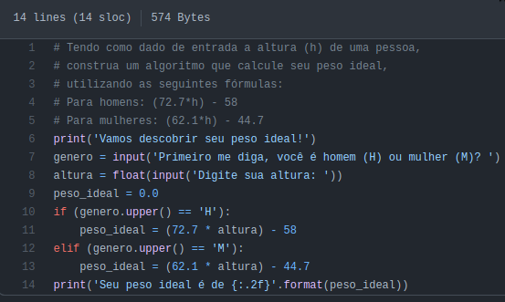

# Python Exercicios
 Este repositório é destinado a Lista de Exercícios de Python disponiblizado pela [Python Wiki Brasil](https://wiki.python.org.br/ListaDeExercicios "Python Wiki").

## Descrição
*'Esta é uma lista com sugestões de programas para iniciantes em programação. Os exercícios podem ser implementados em pseudo-código, Python, C, C++, Java, Pascal ou em qualquer outra linguagem. Os exercícios estão divididos em categorias e procuram obedecer uma ordem de dificuldade crescente. Cada exercício é independente do outro, sendo possível deixar exercícios para trás sem grandes prejuízos.'*

## Lista de Exercícios
Os exercícios estão dividos em seus respectivos repositórios, o enunciado de cada atividade pode ser visualizado no próprio site da Python Wiki ou como um comentário no arquivo de resolução do mesmo.
1. **EstruturaSequencial**
1. **EstruturaDeDecisao**
1. **EstruturaDeRepeticao**
1. **ExerciciosListas**
1. **ExerciciosFuncoes**
1. **ExerciciosComStrings**
1. **ExerciciosArquivos**
1. **ExerciciosClasses**
1. **ListaDeExerciciosProjetos**

### Resolução de Exercício - Exemplo
